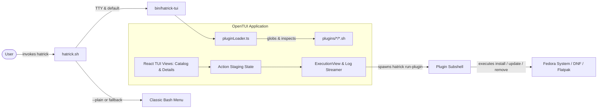

# Requirements

### Overview & Goals
Build a modern, responsive Terminal User Interface (TUI) for Hatrick using the OpenTUI framework (TypeScript/React on the Zig native core). The TUI serves as Hatrick's primary interactive installation tool on Fedora, providing clear visibility into installed and uninstalled plugins across categories while introducing action-ready support for installation, optional updates, and optional removals without altering Hatrick's simple plugin architecture.

### Scope
- **In Scope**:
  - OpenTUI TypeScript application located in `tui/` utilizing `@opentui/react` and `@opentui/core`.
  - Standalone single-file binary compilation via Bun (`bun build --compile`), producing `bin/hatrick-tui` that runs out of the box on vanilla Fedora without external Node or Bun dependencies.
  - Direct TypeScript plugin discovery and evaluation using lightweight bash inspection subshells that source `lib/*.sh` and probe plugin state.
  - Interactive browsing view displaying categorized plugins, installed vs not installed status, descriptions, and dependency requirements.
  - Action staging controls supporting `install`, optional `update` (`plugin_update`), and optional `remove` (`plugin_remove`).
  - In-app execution view with live output streaming, step progress tracking, and post-install summary.
  - Integration with `hatrick.sh`, launching OpenTUI by default for interactive runs while retaining a `--plain` / `--cli` fallback to the classic text menu.
- **Out of Scope**:
  - Altering the filesystem structure or file conventions of existing plugins in `plugins/`.
  - Introducing central databases, daemon processes, or cloud registries.
  - Modifying base Fedora package sets outside what plugins and `hatrick.sh` already manage.

### User Stories
- **As a Fedora user running Hatrick on a fresh machine**, I want a clean, visually structured terminal interface where I can see which tools are already present and easily select what to install.
- **As an existing Hatrick user**, I want to see which installed plugins have update or removal capabilities so that I can maintain or clean up my development environment.
- **As a user running the installation**, I want to see real-time log output and progress indicators inside the application so that I have complete transparency into system changes.
- **As a user in a minimal or non-interactive environment**, I want to use `--plain` or standard CLI commands to bypass the graphical TUI when needed.

### Functional Requirements
- **Plugin Catalog & Status Display**:
  - Discover plugins dynamically from `plugins/*/*.sh`.
  - Group plugins by category directory (e.g. `00-system`, `10-desktop`, `20-webapps`, `30-development`, `40-cloud`).
  - Indicate installed status (`[✓]` Installed, `[ ]` Not installed) evaluated via `plugin_detect`.
- **Action Selection & Staging**:
  - Allow selecting actions per plugin: `Install` (or `Reinstall`), `Update` (if supported), and `Remove` (if supported).
  - Check whether plugins declare `plugin_update` and `plugin_remove` hooks; disable unsupported actions with helpful explanations.
  - If a plugin lacks `plugin_update`, allow updating by re-running `plugin_install` where applicable.
- **Dependency Handling**:
  - Inspect `PLUGIN_REQUIRES` and warn or stage dependencies when an action is queued (e.g., notifying when a webapp requires `vivaldi`).
- **In-App Execution & Live Output**:
  - On confirmation, transition from the selection UI to an embedded execution view.
  - Run base package upgrades, font installations, and staged plugin actions in sequence.
  - Stream `stdout` and `stderr` directly into a scrollable OpenTUI log component in real time.
- **Execution Completion & Reboot**:
  - Display execution summary with success/failure statuses for each step.
  - Prompt user to reboot if plugins flagged desktop or kernel changes.
- **CLI & Script Routing**:
  - Running `hatrick` or `./hatrick.sh` interactively launches `bin/hatrick-tui` if present.
  - Passing `--plain` or `--cli` launches the legacy text menu.
  - Subcommands like `hatrick list` and `hatrick run-plugin` remain available for scripting.

### Non-Functional Requirements
- **Zero Host Runtime Dependencies**: The compiled binary must be fully self-contained (Linux x64 glibc), requiring no Node.js, Bun, or NPM packages pre-installed on the host machine.
- **Performance**: Initial catalog load and status inspection must complete within 500ms; UI rendering must be smooth and responsive to keyboard input.
- **Simplicity & Idempotency**: Respect Hatrick's design principle ("Keep it stupid simple"). Plugins remain standalone Fedora shell scripts with minimal boilerplate.

# Technical Design

### Current Implementation
- `hatrick.sh`: Main entry script that sources `lib/fonts.sh`, `lib/theme.sh`, and `lib/webapp.sh`. Discovers plugins via `plugins/*/*.sh`, checks installation state with `is_installed()` (which invokes `plugin_detect`), presents a numbered terminal prompt, prompts for sudo, and runs `install_selected()`.
- Plugins: Shell scripts that define `PLUGIN_DESC`, `plugin_install()`, and optionally `plugin_detect()`, `PLUGIN_REQUIRES`, and `PLUGIN_DISABLED`.

### Key Decisions
1. **Direct TypeScript Plugin Loader**:
   - *Chosen Approach*: OpenTUI directly globs `plugins/*/*.sh` and executes lightweight bash subshells to extract variables (`PLUGIN_DESC`, `PLUGIN_REQUIRES`, `PLUGIN_DISABLED`) and function existence (`declare -F plugin_detect`, `declare -F plugin_update`, `declare -F plugin_remove`).
   - *Rationale*: Avoids altering the plugin format or requiring manifest files, ensuring 100% backward compatibility with all existing plugins and libraries.
2. **Action Contract Expansion**:
   - *Chosen Approach*: Formally support optional `plugin_update()` and `plugin_remove()` functions in plugin scripts. If `plugin_update` is missing, update defaults to running `plugin_install`; if `plugin_remove` is missing, removal is disabled in the UI.
   - *Rationale*: Directly meets the requirement for future update/remove actions while keeping the plugin contract as simple as it is today.
3. **In-App Execution & Logging**:
   - *Chosen Approach*: Keep OpenTUI running throughout installation, transitioning from selection view to an embedded `ExecutionView` that spawns child processes and streams stdout/stderr directly into a terminal log component.
   - *Rationale*: Provides a modern installation experience where users monitor progress and errors in-place without jarring terminal exits.
4. **Standalone Bun Binary Compilation**:
   - *Chosen Approach*: Build the OpenTUI application using `bun build --compile ./src/index.tsx --outfile ../bin/hatrick-tui`.
   - *Rationale*: Guarantees that vanilla Fedora machines with fresh OS installs can run the TUI without installing Node, Bun, or JavaScript runtimes.
5. **CLI Integration in `hatrick.sh`**:
   - *Chosen Approach*: Check for interactive TTY in `hatrick.sh`. If present and `bin/hatrick-tui` exists, invoke it via `exec`. Support `--plain` flag to force the classic text menu, and add `hatrick run-plugin <name> <action>` to serve as the backend execution target for the TUI runner.
   - *Rationale*: Delivers seamless TUI out of the box while maintaining scriptability and headless fallback.

### Architecture Diagram


### Data Models / Contracts

#### TypeScript Interfaces (`tui/src/types.ts`)
```typescript
export type PluginActionType = 'install' | 'update' | 'remove' | 'none';

export interface PluginMetadata {
  id: string;              // e.g. "docker"
  category: string;        // e.g. "development"
  filePath: string;        // absolute path to script
  description: string;     // PLUGIN_DESC
  requires: string[];      // PLUGIN_REQUIRES
  disabled: boolean;       // PLUGIN_DISABLED
  isInstalled: boolean;    // result of plugin_detect
  supportsDetect: boolean; // whether plugin_detect exists
  supportsUpdate: boolean; // whether plugin_update exists
  supportsRemove: boolean; // whether plugin_remove exists
}

export interface StagedAction {
  plugin: PluginMetadata;
  action: PluginActionType;
}

export interface ExecutionStep {
  id: string;
  title: string;
  status: 'pending' | 'running' | 'success' | 'failed';
  error?: string;
}
```

#### Plugin Shell Contract (`plugins/<category>/<name>.sh`)
```bash
PLUGIN_DESC="Short summary of tool"          # Required
PLUGIN_REQUIRES="tool1 tool2"                 # Optional
PLUGIN_DISABLED=1                            # Optional

plugin_install() { ... }                      # Required
plugin_detect()  { ... }                      # Optional (0 = installed)
plugin_update()  { ... }                      # Optional (defaults to install)
plugin_remove()  { ... }                      # Optional (disabled if absent)
```

#### CLI Execution Target
```bash
hatrick run-plugin <plugin_name> <install|update|remove>
```
Executes the target action within the sourced Hatrick environment, returning standard exit codes and emitting logs to stdout/stderr.

### Components
- `tui/src/index.tsx`: Application bootstrap; creates OpenTUI CLI renderer and renders the React root.
- `tui/src/App.tsx`: Top-level state coordinator managing view transitions (`browse` -> `confirm` -> `executing` -> `finished`).
- `tui/src/components/PluginCatalog.tsx`: Two-pane layout with category sidebar, searchable plugin list, and status badges.
- `tui/src/components/PluginDetail.tsx`: Inspector view showing descriptions, requirements, and interactive buttons for Install, Update, and Remove.
- `tui/src/components/ExecutionView.tsx`: Active installation dashboard featuring a step checklist and live auto-scrolling log console.
- `tui/src/services/pluginLoader.ts`: File discovery and bash subshell inspection engine.
- `tui/src/services/executor.ts`: Process runner orchestrating sequential `hatrick run-plugin` commands.

### File Structure
```
Hatrick/
├── bin/
│   └── hatrick-tui                  # Compiled standalone OpenTUI binary
├── hatrick.sh                       # Launcher with TUI routing and run-plugin subcommand
├── install.sh                       # System installer updating symlinks and binary
├── lib/                             # Existing shell libraries (fonts, theme, webapp)
├── plugins/                         # Existing plugin definitions
├── scripts/
│   └── build-tui.sh                 # Bun compilation build script
└── tui/
    ├── package.json                 # OpenTUI & React dependencies
    ├── tsconfig.json                # TypeScript configuration
    └── src/
        ├── index.tsx                # CLI renderer entry point
        ├── App.tsx                  # Root React component
        ├── types.ts                 # Data models
        ├── components/
        │   ├── Header.tsx           # App header & system info
        │   ├── PluginCatalog.tsx    # List and category navigation
        │   ├── PluginDetail.tsx     # Details and action controls
        │   ├── ConfirmModal.tsx     # Action confirmation review
        │   └── ExecutionView.tsx    # Live progress and log view
        └── services/
            ├── pluginLoader.ts      # Plugin inspection & detection
            └── executor.ts          # Process execution & log streaming
```

### Risks & Mitigations
- **Sudo timeout during in-app execution**:
  *Risk*: Sudo credentials may expire while long-running package downloads execute, causing hidden prompts.
  *Mitigation*: Run `sudo -v` upfront and maintain a background keepalive loop inside the runner process for the duration of execution.
- **Terminal size and resize events**:
  *Risk*: Narrow terminals could distort two-pane layout or log boxes.
  *Mitigation*: OpenTUI auto-handles SIGWINCH and flexbox re-layout; provide responsive layout rules that stack panels on smaller terminals (<80 columns).
- **ANSI formatting in log streams**:
  *Risk*: DNF or curl raw escape codes may clutter the log pane.
  *Mitigation*: Use OpenTUI's built-in ANSI stripping and styled text renderables to ensure clean terminal output rendering.

# Testing

### Validation Approach
Verification combines automated build and inspection tests with end-to-end interactive CLI checks:
- Verify that `pluginLoader.ts` discovers all existing plugins and accurately reports metadata and detection states.
- Verify that Bun single-file compilation builds cleanly and runs on Linux x64 glibc without dynamic JavaScript dependencies.
- Validate execution flows (install, update fallback, remove) across representative plugins.
- Test fallback behavior when running with `--plain`, without a TTY, or when the binary is absent.

### Key Scenarios
1. **Catalog Browsing & Detection**:
   - Launch TUI and verify that all plugins under `plugins/*/*.sh` appear in their appropriate categories.
   - Confirm that installed tools (e.g. tools already on the system like `git` or base packages) display `[✓]` while absent tools display `[ ]`.
2. **Action Staging & Capability Enforcement**:
   - Select an uninstalled plugin and stage for `Install` via `i` or `Space`.
   - Select an installed plugin: verify `Update` is enabled, and verify `Remove` is enabled only if `plugin_remove` is defined.
   - Verify that plugins without `plugin_remove` clearly indicate that automated removal is not supported.
3. **In-App Execution & Log Streaming**:
   - Confirm staged actions and observe transition to `ExecutionView`.
   - Verify that DNF, font downloads, and plugin installation logs stream live into the log component.
   - Confirm that step statuses transition from `pending` -> `running` -> `success`.
4. **CLI Routing & Flag Compatibility**:
   - Run `hatrick` in terminal -> launches OpenTUI interface.
   - Run `hatrick --plain` -> launches classic numbered text menu.
   - Run `hatrick list` -> prints standard non-interactive list.
   - Run `echo "" | hatrick` (non-interactive pipe) -> cleanly falls back without hanging.

### Edge Cases
- **Missing or broken plugin detection**: Ensure plugins without `plugin_detect` default to uninstalled/action-available without crashing the scanner.
- **Dependency alerts**: Verify that staging a webapp (e.g. `whatsapp.sh`) alerts the user if `vivaldi` is not installed or staged.
- **Process failure during installation**: If a plugin fails midway, the execution view must mark that step as failed, display the error in the log viewer, and allow the user to review before returning or exiting.
- **Terminal resize during log streaming**: Verify that resizing the terminal window during an active install does not corrupt log line wrapping or freeze the interface.

# Delivery Steps

### ✓ Step 1: Add plugin execution subcommands and TUI routing to hatrick.sh
`hatrick.sh` supports executing individual plugin lifecycle actions via CLI and automatically delegates interactive runs to `bin/hatrick-tui`.

- Add `run-plugin <name> <action>` subcommand to `hatrick.sh` to execute `plugin_install`, `plugin_update`, or `plugin_remove` within the proper Hatrick environment (sourcing `lib/fonts.sh`, `lib/theme.sh`, and `lib/webapp.sh`).
- Add fallback behavior to `plugin_update` (defaulting to `plugin_install` if no custom update hook is declared) and guard `plugin_remove` to fail cleanly if not supported.
- Update `hatrick.sh` entry point to detect interactive TTY sessions and delegate to `bin/hatrick-tui` when present, while preserving `--plain` / `--cli` flags to fall back to the existing terminal menu.
- Ensure `install.sh` maintains symlink compatibility with the new launcher routing.

### ✓ Step 2: Scaffold OpenTUI project and implement direct plugin loader
A standalone TypeScript project in `tui/` configured with OpenTUI and capable of discovering and probing plugins via direct subshells.

- Scaffold `tui/package.json` with dependencies on `@opentui/core` and `@opentui/react`, along with TypeScript configuration.
- Implement `pluginLoader.ts` to scan `plugins/*/*.sh`, parse static headers (`PLUGIN_DESC`, `PLUGIN_REQUIRES`, `PLUGIN_DISABLED`), and extract group names.
- Implement bash probe execution in `pluginLoader.ts` to evaluate `plugin_detect`, detect declaration of `plugin_update` and `plugin_remove`, and return strongly-typed `PluginMetadata` objects.
- Add unit tests verifying plugin discovery, status detection, and action capability detection against real plugins in `plugins/`.

### ✓ Step 3: Build interactive browsing, filtering, and action staging UI
A full-featured terminal interface in OpenTUI displaying categorized plugins, installed status, details, and action staging controls.

- Implement header and navigation layout with categories sidebar and plugin list view in `tui/src/components/PluginList.tsx`.
- Add visual indicators for installed (`[✓]`) vs not-installed (`[ ]`) plugins, along with staged action badges (`[INSTALL]`, `[UPDATE]`, `[REMOVE]`).
- Implement `PluginDetail.tsx` displaying plugin description, requirements, detection status, and keyboard shortcut hints.
- Implement action staging logic: pressing `i` stages install/reinstall, `u` stages update (when supported), `r` stages remove (when supported), and `Space` toggles primary action.
- Add dependency resolver that warns or automatically stages prerequisite plugins defined in `PLUGIN_REQUIRES`.
- Implement confirmation modal/view displaying summary of all staged actions prior to execution.

### ✓ Step 4: Implement in-app execution view, log streaming, and build pipeline
The TUI seamlessly switches to an embedded execution view during installation and compiles into a standalone binary for distribution.

- Implement `ExecutionView.tsx` with a step checklist showing progress through base packages, fonts setup, and each staged plugin action.
- Implement `executor.ts` to manage subprocess execution of `hatrick run-plugin` commands and stream live stdout/stderr into an auto-scrolling terminal log pane.
- Add sudo credential verification and background keepalive loop during the execution phase.
- Implement execution summary screen with elapsed time, error indicators, and optional system reboot prompt.
- Create `scripts/build-tui.sh` and Bun compilation pipeline (`bun build --compile ./src/index.tsx --outfile ../bin/hatrick-tui`) to produce a self-contained binary runnable on fresh Fedora systems.